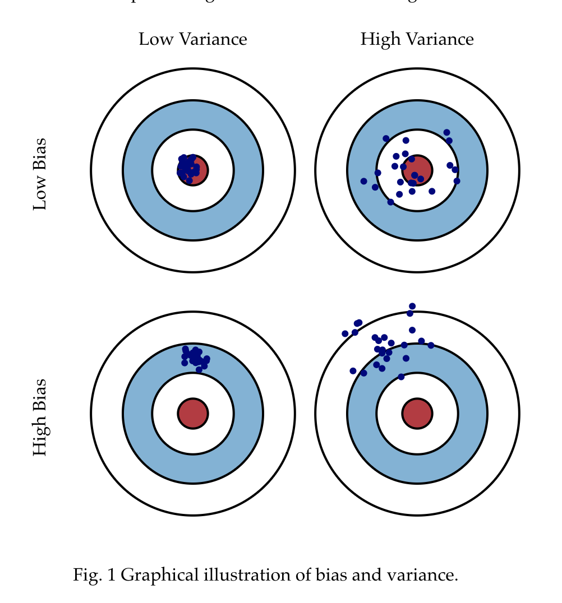

# 方差和偏差的平衡

预测误差可以被分解成两个，一个是“偏差”一个是“方差”，在最小化偏差的时候必须要和方差做一个平衡。

------

林轩田的课中讲到，训练一个模型的最终目的，是为了让这个模型在测试数据上拟合效果好，也就是Error(test)比较小，但是实际问题中，test data我们拿不到，不知道其中的内在规律，如果知道规律就不需要训练过程了，所以如何采用策略去减小Error(test).

1. 让Error(train)尽可能小

2. 让Error(train)尽可能等于Error(test)

   因为Error(train)小，而且Error(train)=Error(test)，所以Error(test)小。

接下来的问题就是：**如何让Error(train)小？**

​    如果我们的模型越复杂，参数越多，这样Error就会比较小，就会有low bias。

再接下来就是：**如何让Error(train)=Error(test)？**

​    如果模型足够简单，参数比较少。Error(train)=Error(test)，就是意味着模型没有偏见，更具有通用性。这样就会得到low variance。

**注意**

**low variance**并不意味着是方差数值较小，所谓的**high variance**就是方差数值过小，导致过拟合。

------

## 1 偏差和方差

了解不同的误差源(也就是数据集)如何导致偏差和方差是有助于改进数据拟合的过程，从而产生更准确的模拟。本文将从三种方式定义偏差和方差：概念、图形、数学。

### 1.1 概念定义

- **由偏差(Bias)导致的误差：** 我们模型的预期（或平均）预测与我们试图预测的正确值之间的差异。当然，你只有一个模型，所以谈论预期或平均预测值可能看起来有点奇怪。但是，假设您可以多次重复整个模型构建过程：每次收集新数据并运行新分析创建新模型。由于基础数据集中的随机性，所得到的模型将具有一系列预测。偏差衡量这些模型的预测与正确值的距离
- **由方差(Variance)导致的误差：**

### 1.2 图片定义

    

[Bias and  Variance]: http://scott.fortmann-roe.com/docs/BiasVariance.html

