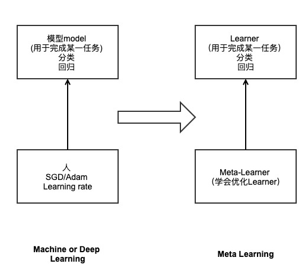
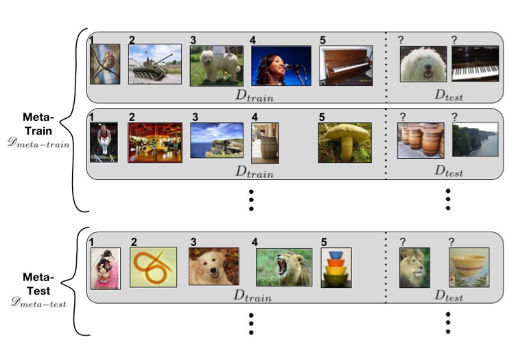
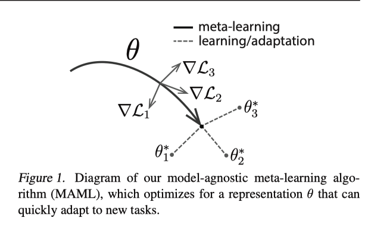
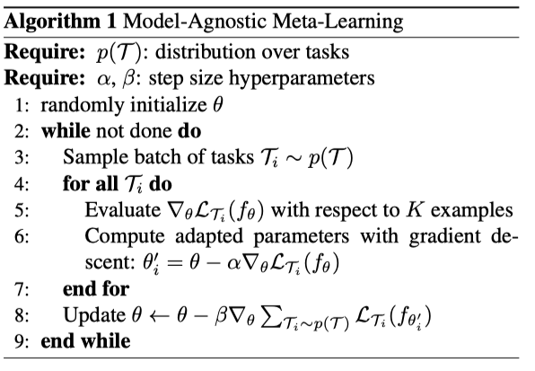
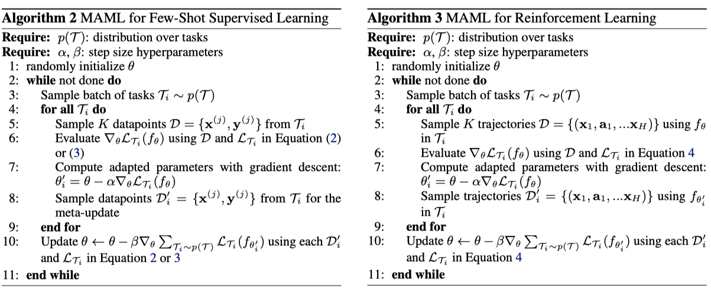

姓名：肖建雄 

学号：2118216049

邮箱：jx0xiao@gmail.com

# 现代方法

我将会介绍两种较为现代的方法来做机器学习任务。第一种叫做meta-learning(元学习)，将会介绍这个模型的背景以及Model-Agnostic Meta-Learning模型算法。第二种是生成式对抗网络（Generative Adversarial Network，GAN）。

## 1. Meta-Learning

​	Meta-Learning意为学会学习，传统的机器学习任务先进行建模完成某一任务，如分类、回归、序列标注等等,再通过代价函数进行优化，如SGD、Adam等等。Meta-Learning通过建模Learner完成某一任务，和传统学习任务类似，但是在优化时，我们选用meta-learner，让其学会优化Learner。如下图：

​	我们在优化不同的模型时，使用不同的方法，所以Meta-Learner在优化时也会采用不同的技术。目前Meta-Learning模型有如下几种，Few Shots Meta-Learning、Optimizer Meta-Learning、Model-Agnostic Meta-Learning、Metric Meta-Learning、Recurrent Model Meta-Learning和Initializations Meta-Learning等。

深度学习在具有大量标记数据的时候，的确在各种任务上有取得了成功，如图像分类、机器翻译等等。这些成就依赖于深度、高容量的模型优化，需要许多标记数据和许多次迭代更新。这种类型的优化在小数据中就会失效，因此希望从极少数标记的样本中学习。这一类问题我们称为few-shot learning。

## 1.1 few-shot learning

few-shot learning指：如何训练一个模型，让其只见过某一个类很少的样本后，就能较好的分类该类样本。

为了提升few-shot learning的性能，我们需要促使模型学习那些能够区分类别的主要特征，而不是对分类样本没有帮助的特征。few-shot learning最常见的办法为学习一个Embedding，将输入空间降低到低维度的空间中，再通过计算欧式距离来判断是否属于该类别。所以主要的任务就是，找出那些最能区分某类样本的特征，并学习如何将输入空间压缩并转换到这类特征中去。

这样做的主要目的是：我们不能只关注某个类别在样本空间上的分布，而应该关注每个类在样本空间的分类。

##1.2 Model-Agnostic Meta-Learning

目前的强化学习模型需要很长的时间来收敛，很多简单的任务，人类很快就可以学会，而强化学习需要经过成千上万轮的训练。最主要的原因是缺乏先验知识（元知识）和快速适应。

先验知识：人类在学习任务中，会学习积累一些普适的、对一些任务都适用的知识。

快速适应：指人类以某种目前我们没法理解的方式具有快速学习的新能力。

我们定义一个模型$f$，将观测值$x$映射到$a$，每个任务$T=\{\mathcal{L}(x_1,a_1,…,x_H,a_H),q(x_1),q(x_{t+1}|x_t,a_t),H\}$，$\mathcal{L}$是损失函数，$q(x_1)$是初始分布，$q(x_{t+1}|x_t,a_t)$是过渡分部（我们可以看成马尔可夫链的状态转移概率），$H$为epsilode长度，在独立同分布的监督学习中$H=1$，该模型可以在每$t$时间选择一个$a_t$来生成长度为$H$的样本。$\mathcal{L}(x_1,a_1,…,x_H,a_H)\to \mathbb{R}$提供了任务反馈，这有可能是马尔可夫决策过程中错误分类或成本函数的形式。

为了让上述模型快速适应新任务，多数方法是通过设定一个超参数、momentum和dropout等等，以此实现小样本分类和快速强化学习。而Model-Agnostic Meta-Learning（简称MAML）通过直接优化一个初始表征，以该表征为基础，模型可以基于少量样本作出梯度更高效的调整，如下图。

我们的目标是训练一个模型使其能最好滴适应一个任务分布p(T),对p(T)中的各种任务模型都能快速适应。

MAML最大的特点是模型无关，MAML对模型的形式不做任何假设，所以可以通过一个普适的方法更新任意模型的参数来使其有快速适应能力。MAML尝试找到那些对任务变化敏感的参数，通过反向传播test上的loss梯度，在这些参数上做出很小的更新便能大幅度提升整个任务分布p(T)上的表现。

具体方法：

1. 随机初始化网络的参数
2. 从任务分布中选取一些任务t, 从训练集中选K个样本(K-shot learning)进行一步梯度更新
3. 在测试集上评价更新后的网络
4. 对任务t的测试表现求初始化网络时的参数的梯度, 然后依据这些梯度更新网络参数然后用更新后的参数返回第一步

算法描述:

形式化表示为：
$$
\mathop{min}_{\theta}\sum_{T_i\sim p(\mathcal{T})}\mathcal{L}_{\mathcal{T_i}}f(_{\theta^{'}_i})=\mathop{\sum}_{T_i\sim p(\mathcal{T})}\mathcal{L}_{\mathcal{T_i}}(f_{\theta-\alpha\nabla_{\theta}\mathcal{L}_i(f_{\theta})})
$$
寻找一组参数$\theta$使任务经过K次更新之后的损失$\mathcal{L}_{\mathcal{T}_i}$之和最小。

这种学习方法可以用到不同的任务中，以下是两种不同任务中的应用。

其中$Equation(2)$是交叉熵/均方误差，$Equation(4)$为强化学习的损失函数。

参考文献：

[1] [Finn C, Abbeel P, Levine S. Model-agnostic meta-learning for fast adaptation of deep networks[C] Proceedings of the 34th International Conference on Machine Learning-Volume 70. JMLR. org, 2017: 1126-1135.](<https://arxiv.org/abs/1703.03400>)

[2] [Ravi S, Larochelle H. Optimization as a model for few-shot learning[J]. 2016](<https://openreview.net/forum?id=rJY0-Kcll¬eId=ryq49XyLg>)

## 2. GAN

GAN相比于其他生成模型，有两个特点:

- 不依赖于任何先验假设。传统方法会假设数据服从某一分布，然后使用极大似然估计去估计数据分布。
- 生成real-like样本的方式非常简单。GAN生成样本的方式通过生成器的前向传播，而传统方法的采样方式非常复杂。

### 2.1 介绍

GAN(Generative Adversarial Networks)，生成式的，对抗网络。通过对抗的方式，去学习数据分布的生成模型。对抗指的是，生成网络和判别网络之间的互相对抗。生成网络尽可能生成逼真样本，判别网络尽可能去判别该样本是否是真实样本。如下图：

隐变量$z$（服从高斯分布的随机噪声）通过Generator生成$X_{fake}$，判别器负责判别输入是生成的$X_{fake}$还是真实的数据$X_{real}$。目标函数如下：
$$
\mathop{min}_{G}\mathop{max}_{D}V(D,G)=\mathop{min}_{G}\mathop{max}_{D}E_{x\sim p_{data}(x)}[log\ D(x)]+E_{z\sim p_z(z)}[log\ (1-D(G(z)))]
$$
判别器$D​$是一个二分类，$V(G,D)​$是交叉熵损失。生成器$G​$为了欺骗$D​$，需要最大化生成样本的判别概率$D(G(z))​$，最小化$log(1-D(G(z)))​$。

在训练时，先训练$D$再训练$G$，不断重复。对于生成器$G$需要最小化
$$
\mathop{max}_{D}V(D,G)
$$
为了保证$V(D,G)$取得最大值，我们需要训练迭代k次判别器$D$，然后迭代1次生成器$G$。当生成器$G$固定时，对$V(G,D)$求导，求出最优判别器$D^*(x)$：
$$
D^*(x)=\frac{p_{data}}{p_g(x)+p_{data}(x)}
$$
把最优判别器带入目标函数，可以求出在最优判别器下，生成器的目标函数等价于优化$p_{data}(x),p_g(x)$的JS散度，当训练量足够时，模型会收敛，二者将会达到纳什均衡。$p_{data}(x)=p_g(x)$，判别器不论对$p_{data}(x)$还是$p_g(x)$中的样本，预测概率均为$\frac{1}{2}$。

### 2.2 目标函数

上一节中我们将优化函数等价于JS散度，而衡量两个分布距离的方式有很多，我们可以通过定义不同的分布距离度量，以此来得到不同的目标函数，从而对GAN进行改进。事实上散度并不是一种距离度量方式，比如A到B的距离是等于B到A的距离的，然而$D(A||B)$和$D(B||A)$不一定相等。

#### 2.2.1 F散度

F散度通过下列公式来定义距离：
$$
D_{f(p_{data}||p_g)}=\int_xp_g(x)f(\frac{p_{data}(x)}{p_g(x)})dx
$$
其中$f$为凸函数，且$f(1)=0$。通过使用不同的$f$函数，也就是生成器，可以得到不同的优化目标。如下：

| GAN   | 散度                   | 生成器 $f(t)$         |
| ----- | ---------------------- | --------------------- |
|       | KL散度                 | $tlogt$               |
| GAN   | JS散度-$2log2$         | $tlogt-(t+1)log(t+1)$ |
| LSGAN | 皮尔逊 $\mathcal{X}^2$ | $(t-1)^2$             |
| EBGAN | 方差和                 | $|t-1|$               |

**LSGAN**

LSGAN是F散度中$f(x)=(t-1)^2$的一种特殊情况。具体来说LSGAN的损失如下：
$$
\mathop{min}_DJ(D)=\mathop{min}_D[\frac{1}{2}E_{x\sim p_{data}(x)}[D(x)-1]^{2}+\frac{1}{2}E_{z\sim p_z(z)[D(G(z))]^2}]
$$
LSGAN的优点在于：

- 稳定训练：解决了训练过程中梯度饱和问题
- 改善生成质量：通过惩罚远离判决器决策边界的生成样本

####2.2.2 积分概率指标（Integral probality metric，IPM）

IPM定义了一个评价函数族$f$，用于度量任意两分布之间的距离。在一个空间$\mathcal{X}\subset R^d$中，定义$\mathcal{P(X)}$为在$\mathcal{X}$上的概率测度。那么两个分布$p_{data}$,$p_g$之间的IPM可以定义为如下：
$$
d_{\mathcal{F}}(p_{data},p_g)=sup_{f\in\mathcal{F}}\mathbb{E}_{x\sim p_{data}[f(x)]}-\mathbb{E}_{x\sim p_{data}}[f(x)]
$$
不同的$f$也可以定义一系列不同的优化目标，如WGAN，FisherGAN等。

**WGAN**

WGAN提出了一个新的距离度量方式，Wasserstein距离。

Wasserstein：
$$
W(p_{data},p_g)=\mathop{inf}_{\gamma\in \prod(\mathbb{P}{_{data},\mathbb{P}_g})}\mathbb{E}_{(x,y)\sim\gamma}[||x-y||]
$$
$\prod(p_{data},p_g)​$表示联合分布，这一组联合分布中的任一分布$\gamma​$的边缘分布均为$p_data(x)​$和$p_g(x)​$。简单来说，WGAN就是把概率分布$p_{data}(x)​$搬到$p_g(x)​$的最小工作量。

#### 2.2.3 IPM和F散度的对比

F散度中存在的问题是，随着数据维度的增加，F散度计算会困难，而IPM则不受数据维度影响。

参考文献：

[1] [Goodfellow I, Pouget-Abadie J, Mirza M, et al. Generative adversarial nets[C]//Advances in neural information processing systems. 2014: 2672-2680.](<http://papers.nips.cc/paper/5423-generative-adversarial-nets>)

## 小结

Meta-Learning现在可以用在很多机器学习任务中，包括LSTM，强化学习等等。但是这些方法之前都是需要大量样本的，我们在将需要大量样本的深度学习优化成小样本学习。我认为新的思路可以考虑把小样本学习运用到传统学习方法中去，减少模型的复杂度。

GAN，现如今弊端太多，训练方式极其不稳定，会出现模式丢失等等。但是GAN作为一种生成模型，其思想值得我们去了解。