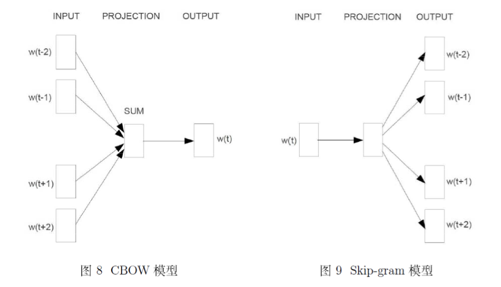

[TOC]

# Word2Vec

对于眼花缭乱的模型一定要把握住motivation，这个模型到底是干嘛的，机器学习的模型往往都是先建模，再构造目标函数，最后进行函数优化，得到一组最优参数后，可以利用最优参数对应的模型来预测。

## 1 背景知识

建议看下背景知识，很多人看懂了n-gram，但是没有理解这个，准确说是不知道这个模型的动机，干了啥，怎么干的。

### 1.1 统计语言模型

计算一个句子的概率的**概率模型**。
$$
W = w_1^T:=(w_1,w_2,...,w_T)\\{w_1^T下标代表起点，上标代表终点}
$$

根据**bayes公式**：
$$
p(w_1^T) = p(w_1)p(w_2|w_1)p(w_3|w_1^2)...p(w_t|w_1^{T-1})\tag{1.1}
$$
**语言模型的参数：**$p(w_1),p(w_2|w_1),p(w_3|w_1^2),…,p(w_T|w_1^{T-1})$

**如何计算这些参数？**

n-gram模型，决策树，最大熵模型，最大熵马尔可夫模型。条件随机场，神经网络等方法。

本文主要讲**n-gram模型**和**神经网络**

### 1.2 n-gram模型

根据公式1.1有：
$$
p(w_k|w_1^{k-1})=\frac{p(w_1^k)}{p(w_1^{k-1})}
$$
根据**大数定理**，当语料库足够大时，$p(w_k|w_1^{k-1})$可以近似地表示为：
$$
p(w_k|w_1^{k-1})\approx\frac{count(w_1^k)}{count(w_1^{k-1})} \tag{1.2}
$$
当$k$较大时，计算$count(w_1^k),count(w_1^{k-1})$  的统计将会耗时。

如果把**$n-gram$模型​**作一个$n-1$阶的**$Markov$假设**
$$
p(w_k|w_1^{k-1})\approx p(w_k|w_{k-n+1}^{k-1})
$$

$$
p(w_k|w_1^{k-1})\approx\frac{count(w_{k-n+1}^k)}{count(w_{k-n+1}^{k-1})} \tag{1.3}
$$

假设$n=2$:
$$
p(w_k|w_1^{k-1})\approx\frac{count(w_{k-1},w_{k})}{count(w_{k-1})}
$$
这样有两个好处：

第一个参数总数变少了，第二个统计时需要匹配的词串更短。

利用**最大似然函数**，把目标函数设为：
$$
\prod_{w\in C}p(w|Context(w))
$$
$C$表示语料（Groups），$Context(w)$表示词$w$的**上下文（Context）**，即$w$周边词的集合。

**最大对数似然函数：**

$$
\mathcal{L} = \sum_{w\in C}log\ p(w|Context(w))
$$

### 1.3 神经概率语言模型

输入层：将$n-1$个词首尾拼接

投影层：长度为$（n-1）m$

输出层：$N=|\mathcal{D}|$
$$
\begin{cases}
z_w = tahh(Wx_w+p)\\
y_w = Uz_w + q
\end{cases}
$$
$tanh$为**双曲正切函数**， 用来做隐藏层的**激活函数**，为了使其表示为概率还需要做一个**softmax**归一化，此时$p(w|Context(w))$就可以表示为：
$$
p(w|Context(w))=\frac{e^{y_w,i_w}}{\sum_{i=1}^{N}e^{y_w,i}}
$$

$i_w$表示词$w$在词典$\mathcal{D}$中的索引。

## 2 基于Hierarchical Softmax模型

本节主要讲**CBOW**和**Skip-gram**，模型如下图所示：

前者是根据上下文$w_{t-2},w_{t-1},w_{t+1},w_{t+2}$预测词向量$w_t$，后者是根据词向量$w_t$预测上下文$w_{t-2},w_{t-1},w_{t+1},w_{t+2}$。

取**对数似然函数**：
$$
\mathcal{L} = \sum_{w\in \mathcal{C}}log\ p(w|Context(w)) \tag{2.1}
$$
优化目标函数：

基于Hierarchical Softmax的CBOW模型：公式2.1

基于Hierarchical Softmax的Skip-gram模型：
$$
\mathcal{L}=\sum_{w\in \mathcal{C}}log\ p(Context(w)|w) \tag{2.2}
$$

### 2.1 CBOW模型

本节介绍CBOW模型，CBOW预测的事的目标是为了最大化$p(w|Context(w))$，$\mathcal{L}=\sum_{w\in\mathcal{C}}logp(w|Context(w))$

#### 2.1.1 网络结构

1. **输入层：**包含$Context(w)$
2. **投影层：**$2c$个向量求和累加
3. **输出层：**输出一棵二叉树

#### 2.1.2 梯度计算

考虑**叶子结点**，假设其对应字典$\mathcal{D}$中的词$w$，

$p^w$：

$l^w$：

$p_1^w,p_2^w,…,p_{l^w}^w$：

$d_2^w,d_3^w…,d_{l^w}^w\in \{0,1\}$：

$\theta_1^w,\theta_2^w,…,\theta_{l^w-1}^w\in \mathbb{R}^m$:路径$p^w$

$$
Label(p_i^w)=1-d_i^w,i=2,3,...,l^w
$$
简而言之**左边负类，右边正类**。

一个节点被分为正类的概率：
$$
\sigma\left(\mathbf{x}_{w}^{\top} \theta\right)=\frac{1}{1+e^{-\mathbf{x}_{w}^{\top}} \theta}
$$
负类的概率：
$$
1-\sigma\left(\mathbf{x}_{w}^{\top} \theta\right)
$$

### 2.2 Skip-gram模型

$$
\begin{aligned} \text { minimize } J &=-\log P\left(w_{c-m}, \ldots, w_{c-1}, w_{c+1}, \ldots, w_{c+m} | w_{c}\right) \\ &=-\log \prod_{j=0, j \neq m}^{2 m} P\left(w_{c-m+j} | w_{c}\right) \\ &=-\log \prod_{j=0, j \neq m}^{2 m} P\left(u_{c-m+j} | v_{c}\right) \\ &=-\log \prod_{j=0, j \neq m}^{2 m} \frac{\exp \left(u_{c-m+j}^{T} v_{c}\right)}{\sum_{k=1}^{|V|} \exp \left(u_{k}^{T} v_{c}\right)} \\ &=-\sum_{j=0, j \neq m}^{2 m} u_{c-m+j}^{T} v_{c}+2 m \log \left(u_{k}^{T} v_{c}\right) \end{aligned}
$$

## 3 基于Negative Sampling模型

